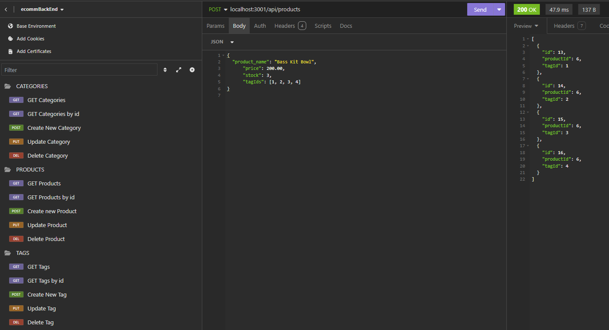

# E-Commerce Back End
  

  

## Description
  

This application is a back end for an e-commerce website that uses the latest technologies so that a company can compete with other e-commerce companies.  This is a demonstration of the use of Sequelize to utilize javascript to communicate with a Postgres database.
  

## Table of Contents
  

- [Installation](#installation)
  
- [Usage](#usage)
  
- [License](#license)
  
- [Contributing](#contributing)
  
- [Tests](#tests)
  
- [Questions](#questions)
  

## Installation
  

To utilize this app, the user should clone the repository to their local machine.  Once cloned, schema and seed commands should be entered to create the associated database.
  

## Usage
  

A demonstration of how to use this application can be found at the following link: https://drive.google.com/file/d/1BVe6C-MqWso5qe7y5Ep2S1LpInxfa2NM/view.

As noted above, this application is a demonstration of the use of Sequelize to utilize javascript to communicate with a Postgres database.  Once installed with the server running, the results of data queries can be viewed by utilizing the 3rd-party application Insomnia.  This is a list of the queries that can be called by this application:
- View all categories
- View all products
- View all tags
- View a single category
- View a single product
- View a single tag
- Create a new category
- Update an existing category
- Delete a category
- Create a new product
- Update an existing product
- Delete a product
- Create a new tag
- Update an existing tag
- Delete a tag

Because this is a back end application, there is no convenient way for users to enter data into it.  Creating and updating data will require the user to format their data submission in JSON within the Insomnia application prior to calling the query.  Furthermore, the id parameter in the URL's will need to be manually changed for single record queries (updating, deleting, or viewing single records).

  

## License
  

This application is operating under the following license: **MIT License**.  
  

Further information regarding this license, to include the required notice, can be read by navigating to the following link: https://opensource.org/licenses/MIT.
  

## Contributing
  

Anyone wishing to contribute to this project can do so by contacting me via the information located in the "Questions" section below.
  

## Tests
  

There are no testing examples.
  

## Questions
  

Any questions regarding this project can be answered by contacting me through my GitHub profile or by email:
  
GitHub Profile: https://github.com/orian42
  
email: orian42@gmail.com
